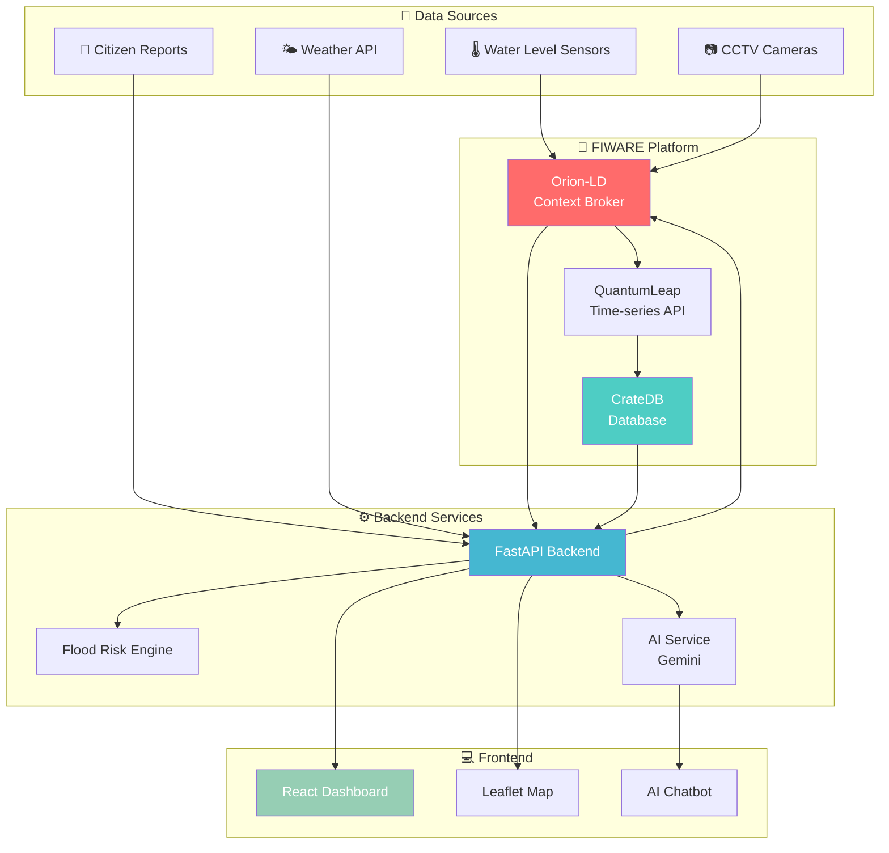

# 🌊 FloodWatch - Hệ thống Giám sát Ngập lụt TP.HCM


> 🏆 **Dự án cho cuộc thi OLP 2025** - Ứng dụng Smart City sử dụng công nghệ FIWARE/NGSI-LD để giám sát và cảnh báo ngập lụt thời gian thực cho TP. Hồ Chí Minh.

---

## 📸 Screenshots

<p align="center">
  
  
</p>

---

## 🎯 Tính năng chính

| Feature | Mô tả |
|---------|-------|
| 📍 **Real-time Monitoring** | Giám sát ngập lụt theo thời gian thực qua WebSocket |
| 🗺️ **15 Polygon Zones** | 15 vùng ngập thực tế TP.HCM với polygon boundaries |
| 🤖 **AI Chatbot** | Trợ lý AI tích hợp Google Gemini để tư vấn |
| 🌤️ **Weather Integration** | Dự báo thời tiết từ OpenWeather cho 22 quận |
| 📝 **Citizen Reports** | Hệ thống báo cáo ngập từ cộng đồng |
| 🔮 **Flood Prediction** | Dự đoán nguy cơ ngập trong 6 giờ tới |
| 📊 **Analytics Dashboard** | Thống kê và phân tích dữ liệu ngập |

---

## 🏗️ Kiến trúc hệ thống



### 📦 Tech Stack

| Layer | Technologies |
|-------|-------------|
| **Frontend** | React 18, TypeScript, Tailwind CSS, Leaflet, shadcn/ui |
| **Backend** | FastAPI, Python 3.10+, WebSocket |
| **Database** | CrateDB (Time-series + Geo-spatial) |
| **Context Broker** | FIWARE Orion-LD (NGSI-LD standard) |
| **AI/ML** | Google Gemini API |
| **Weather** | OpenWeather API |
| **Container** | Docker, Docker Compose |

---

## 🚀 Quick Start

### Prerequisites

- Docker & Docker Compose
- Node.js 18+ (for frontend development)
- Python 3.10+ (for backend development)

### 1️⃣ Clone Repository

```bash
git clone https://github.com/your-repo/FloodWatch.git
cd FloodWatch
```

### 2️⃣ Start FIWARE Services

```bash
docker-compose up -d
```

Điều này sẽ khởi động:
- Orion-LD (port 1026)
- CrateDB (port 4200)
- QuantumLeap (port 8668)

### 3️⃣ Start Backend

```bash
cd simulation/processor-backend/backend
pip install -r requirements.txt
uvicorn app.main:app --reload --port 8000
```

### 4️⃣ Start Frontend

```bash
cd client
npm install
npm run dev
```

### 5️⃣ Access Application

| Service | URL |
|---------|-----|
| 🖥️ Frontend | http://localhost:5173 |
| 📡 Backend API | http://localhost:8000 |
| 📚 Swagger Docs | http://localhost:8000/docs |
| 📖 ReDoc | http://localhost:8000/redoc |
| 🗄️ CrateDB Admin | http://localhost:4200 |

---

## 📡 API Endpoints

### Dashboard
| Method | Endpoint | Mô tả |
|--------|----------|-------|
| GET | `/api/dashboard/stats` | Thống kê tổng quan |
| GET | `/api/dashboard/districts` | Thống kê theo quận |

### Flood Data
| Method | Endpoint | Mô tả |
|--------|----------|-------|
| GET | `/api/flood/nearby` | Điểm ngập gần vị trí |
| GET | `/api/flood/prediction` | Dự đoán ngập 6h tới |
| GET | `/api/flood/risk-analysis` | Phân tích AI |

### Reports
| Method | Endpoint | Mô tả |
|--------|----------|-------|
| POST | `/report` | Gửi báo cáo ngập |
| GET | `/api/reports/recent` | Báo cáo gần đây |
| GET | `/api/reports/{id}` | Chi tiết báo cáo |

### Weather
| Method | Endpoint | Mô tả |
|--------|----------|-------|
| GET | `/api/weather/current` | Thời tiết hiện tại |
| GET | `/api/weather/all` | Thời tiết 22 quận |
| GET | `/api/weather/districts` | Danh sách quận |

### Chatbot
| Method | Endpoint | Mô tả |
|--------|----------|-------|
| POST | `/api/chat` | Chat với AI |
| POST | `/api/chat/clear` | Xóa lịch sử chat |

### WebSocket
| Endpoint | Mô tả |
|----------|-------|
| `ws://localhost:8000/ws/map` | Real-time map updates |

---

## 📊 Severity Levels

Hệ thống phân loại mức độ ngập dựa trên **mức nước tuyệt đối**:

| Level | Water Level | Icon | Mô tả |
|-------|-------------|------|-------|
| 🟢 **Low** | < 0.2m | 💧 | Dưới 20cm - không đáng lo |
| 🟡 **Moderate** | 0.2-0.5m | ⚠️ | 20-50cm - cần chú ý |
| 🟠 **High** | 0.5-1.0m | 🚨 | 50-100cm - nguy hiểm |
| 🔴 **Severe** | > 1.0m | ☠️ | Trên 100cm - rất nguy hiểm |

---

## 🗺️ 15 Polygon Flood Zones

Dữ liệu từ thực tế TP.HCM:

1. **Nguyễn Hữu Cảnh** - Bình Thạnh (ngập nặng nhất)
2. **Phạm Văn Đồng** - Bình Thạnh
3. **Võ Văn Ngân** - Thủ Đức
4. **Huỳnh Tấn Phát** - Quận 7
5. **Nguyễn Văn Linh** - Quận 7
6. **An Dương Vương** - Quận 6
7. **Nguyễn Văn Quá** - Quận 12
8. **Trường Chinh** - Tân Bình
9. **Tô Ngọc Vân** - Quận 12
10. **Phan Huy Ích** - Gò Vấp
11. **Lê Đức Thọ** - Gò Vấp
12. **Quốc lộ 1A** - Quận 12
13. **Thảo Điền** - Thủ Đức
14. **Bình Quới** - Bình Thạnh
15. **Trần Xuân Soạn** - Quận 7

---

## 🧪 Testing

```bash
cd simulation/processor-backend/backend

# Chạy tất cả tests
pytest tests/ -v

# Chạy test cụ thể
pytest tests/test_severity.py -v
pytest tests/test_risk_score.py -v
pytest tests/test_api.py -v

# Chạy với coverage
pytest tests/ --cov=app --cov-report=html
```

---

## 📁 Project Structure

```
FloodWatch/
├── 📂 client/                    # React Frontend
│   ├── src/
│   │   ├── components/           # UI Components
│   │   ├── pages/                # Page Components
│   │   ├── services/             # API Services
│   │   └── hooks/                # Custom Hooks
│   └── package.json
│
├── 📂 simulation/                # Backend Services
│   ├── processor-backend/
│   │   └── backend/
│   │       ├── app/
│   │       │   ├── main.py       # FastAPI Application
│   │       │   └── services/     # Business Logic
│   │       └── tests/            # Unit Tests
│   │
│   ├── water_level_sensor/       # Sensor Simulator
│   └── weather_observation/      # Weather Simulator
│
├── 📂 entities/                  # NGSI-LD Entity Definitions
├── 📂 subscription/              # Orion-LD Subscriptions
├── docker-compose.yml            # Docker Services
└── README.md
```

---

## 🔒 Security Features

- ✅ **Rate Limiting**: 30 requests/minute cho AI endpoints
- ✅ **Input Validation**: Kiểm tra tọa độ, file upload
- ✅ **CORS Configuration**: Cấu hình origins cho production
- ✅ **Image Validation**: Kiểm tra file type và size

---

## 🤝 Contributing

1. Fork the repository
2. Create feature branch (`git checkout -b feature/AmazingFeature`)
3. Commit changes (`git commit -m 'Add AmazingFeature'`)
4. Push to branch (`git push origin feature/AmazingFeature`)
5. Open Pull Request

---

## 📝 License

This project is licensed under the MIT License - see the [LICENSE](LICENSE) file for details.

---

## 👥 Team

- **FloodWatch Team** - *OLP 2025*

---

## 🙏 Acknowledgments

- [FIWARE Foundation](https://www.fiware.org/) - NGSI-LD Standard
- [OpenWeather](https://openweathermap.org/) - Weather API
- [Google Gemini](https://ai.google.dev/) - AI API
- TP. Hồ Chí Minh - Dữ liệu điểm ngập thực tế

---

<p align="center">
  Made with ❤️ for Smart City Vietnam
</p>
